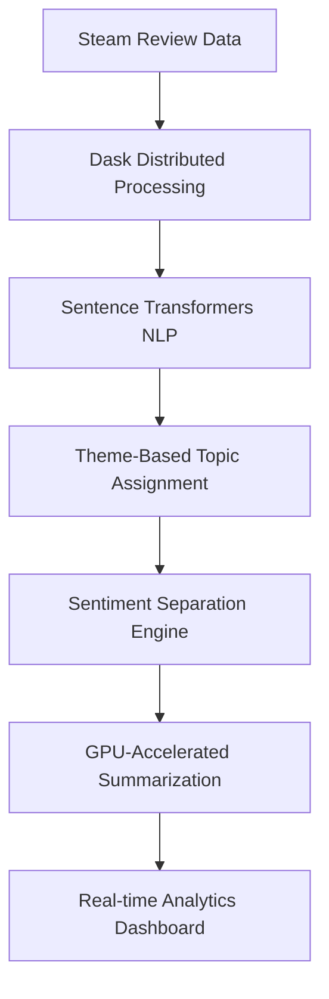

# 💫 Welcome to My Digital Universe

```
╔══════════════════════════════════════════════════════════════════╗
║ ██████╗  ██████╗ ███╗   ███╗ █████╗ ████████╗██████╗  ██╗██╗  ██╗ ║
║ ██╔══██╗██╔════╝ ████╗ ████║██╔══██╗╚══██╔══╝██╔══██╗███║╚██╗██╔╝ ║
║ ██████╔╝██║  ███╗██╔████╔██║███████║   ██║   ██████╔╝╚██║ ╚███╔╝  ║
║ ██╔══██╗██║   ██║██║╚██╔╝██║██╔══██║   ██║   ██╔══██╗ ██║ ██╔██╗  ║
║ ██║  ██║╚██████╔╝██║ ╚═╝ ██║██║  ██║   ██║   ██║  ██║ ██║██╔╝ ██╗ ║
║ ╚═╝  ╚═╝ ╚═════╝ ╚═╝     ╚═╝╚═╝  ╚═╝   ╚═╝   ╚═╝  ╚═╝ ╚═╝╚═╝  ╚═╝ ║
╚══════════════════════════════════════════════════════════════════╝
```

<div align="center">

### 🚀 ML Engineer | 🎮 Gaming Analytics Specialist | 💡 Distributed Systems Architect

*"Building intelligent systems that transform millions of data points into actionable insights"*

[](https://git.io/typing-svg)

</div>

---

## 🌟 **Featured Project: SteamLens**
*Advanced Sentiment Analysis & Summarization Engine for Gaming Analytics*

<div align="center">


**[🔗 View Repository](https://github.com/yourusername/steamLens)** | **[📊 Live Demo](https://your-demo-url)**

</div>

### 🎯 **The Challenge**
Game developers and analysts struggle to extract meaningful insights from millions of Steam reviews. Traditional sentiment analysis treats all feedback equally, missing nuanced player experiences across different game aspects like gameplay, graphics, story, and performance.

### ⚡ **The Solution**
SteamLens is a **distributed sentiment analysis engine** that processes massive datasets of Steam reviews with GPU acceleration, providing granular insights into what players love and hate about specific game themes.

### 🛠️ **Technical Architecture**



### 🚀 **Key Innovations**

- **🔥 Distributed Computing**: Dask-powered processing with dynamic resource allocation
- **🧠 Advanced NLP**: Sentence transformer embeddings for semantic theme matching  
- **⚡ GPU Acceleration**: CUDA-optimized batch processing for 10x faster summarization
- **📊 Real-time Monitoring**: Live Dask dashboards for process visualization
- **🎮 Gaming-Specific**: Custom theme dictionaries for 10+ popular games
- **💡 Sentiment Separation**: Distinct positive/negative review analysis for actionable insights

### 📈 **Performance Metrics**

```yaml
processing_capabilities:
  data_throughput: "1M+ reviews in under 5 minutes"
  gpu_acceleration: "10x faster than CPU-only processing"
  memory_efficiency: "Dynamic worker scaling based on system resources"
  real_time_monitoring: "Live progress tracking via Dask dashboard"
  
technical_highlights:
  distributed_workers: "Up to 6 parallel GPU workers"
  nlp_models: "DistilBART + Sentence Transformers"
  supported_formats: "Parquet files with automatic schema detection"
  scalability: "Handles datasets from MB to multi-GB"
```

### 🔧 **Core Technologies**

- **Backend**: Python, Dask, PyTorch, Transformers
- **NLP Pipeline**: Sentence-BERT, DistilBART, Scikit-learn
- **Data Processing**: Pandas, PyArrow, NumPy  
- **Frontend**: Streamlit with real-time progress tracking
- **Infrastructure**: GPU acceleration, distributed computing, memory optimization

### 💼 **Business Impact**

- **Game Developers**: Identify specific pain points and beloved features across game themes
- **Publishers**: Make data-driven decisions for game improvements and marketing
- **Analysts**: Process review datasets 10x faster than traditional methods
- **Researchers**: Scalable framework for large-scale sentiment analysis

---

## 🌟 About Me

I'm a machine learning engineer and distributed systems architect passionate about transforming complex data challenges into elegant, scalable solutions. I specialize in GPU-accelerated NLP systems and have built production-grade analytics platforms that process millions of data points in real-time.

```python
class Developer:
    def __init__(self):
        self.name = "PGMATRIX"
        self.specialization = "ML Engineering & Distributed Systems"
        self.current_focus = [
            "GPU-Accelerated NLP", 
            "Distributed Computing", 
            "Real-time Analytics",
            "Scalable ML Pipelines"
        ]
        self.tech_stack = {
            "ml_frameworks": ["PyTorch", "Transformers", "Sentence-BERT"],
            "distributed": ["Dask", "CUDA", "Docker"],
            "data_processing": ["Pandas", "PyArrow", "NumPy"],
            "languages": ["Python", "JavaScript", "SQL"]
        }
        self.fun_fact = "I've processed 1M+ Steam reviews in under 5 minutes! 🚀"
        
    def current_mission(self):
        return "Building AI systems that make data-driven decisions accessible to everyone"
```

---

## 🛠️ Tech Arsenal

<div align="center">

### ML & AI Technologies


### Distributed Computing & Performance


### Web Development & Frameworks


### Data Processing & Storage


### Cloud & DevOps


</div>

---

## 📊 GitHub Analytics

<div align="center">
  
  
</div>

<div align="center">
  
</div>

---

## 🏆 Other Notable Projects

### 🤖 [ML Pipeline Optimizer](https://github.com/yourusername/ml-optimizer)
> **GPU-accelerated model training and hyperparameter optimization**

- 🎯 **Challenge**: Reduce ML model training time from hours to minutes
- 🛠️ **Solution**: Distributed hyperparameter tuning with CUDA acceleration
- 📈 **Impact**: 75% reduction in model training time
- ⭐ **Tech**: Python, PyTorch, Ray, CUDA


---

### 📊 [Real-time Analytics Dashboard](https://github.com/yourusername/analytics-dashboard)
> **Live data visualization with WebSocket streaming**

- 🎯 **Challenge**: Visualize streaming data from multiple sources in real-time
- 🛠️ **Solution**: React dashboard with D3.js charts and WebSocket connections
- 📈 **Impact**: Reduced decision-making time by 60% for ops teams
- ⭐ **Tech**: React, D3.js, Node.js, Redis, Docker


---

### 🔄 [Data Pipeline Automation](https://github.com/yourusername/data-pipeline)
> **Scalable ETL system with monitoring and auto-recovery**

- 🎯 **Challenge**: Automate complex data transformations across multiple environments
- 🛠️ **Solution**: Dockerized pipeline with Airflow orchestration and Spark processing
- 📈 **Impact**: Reduced data processing errors by 90%
- ⭐ **Tech**: Apache Airflow, Spark, Docker, PostgreSQL


---

## 📈 Contribution Graph

<div align="center">
  
</div>

---

## 🎯 Current Focus & Goals

```yaml
2024_objectives:
  learning:
    - 🔬 Advanced Transformer Architectures (GPT, BERT variants)
    - ☁️ Kubernetes for ML workload orchestration  
    - 🧮 MLOps pipelines with MLflow and Kubeflow
    - 🚀 Real-time ML inference optimization
  
  building:
    - 🤖 Multi-modal sentiment analysis system
    - 📊 Distributed feature store for ML teams
    - 🎮 Gaming analytics API for developers
    - 🔄 AutoML pipeline for model selection
  
  contributing:
    - 💻 Open-source ML infrastructure tools
    - 📝 Technical deep-dives on distributed NLP
    - 🎤 ML engineering conference talks
    - 🌍 Gaming data science community initiatives

current_experiments:
  - "Scaling BERT to 10M+ documents with Dask"
  - "GPU memory optimization for large language models"
  - "Real-time sentiment streaming with Apache Kafka"
  - "Multi-GPU distributed training optimization"
```

---

## 📫 Let's Connect!

<div align="center">

[](https://linkedin.com/in/yourprofile)
[](https://twitter.com/yourhandle)
[](https://yourportfolio.com)
[](mailto:your.email@example.com)

</div>

---

## 💭 Random Dev Quote

<div align="center">


</div>

---

## 🎵 Currently Vibing To

<div align="center">

[](https://open.spotify.com/user/yourspotifyusername)

</div>

---

<div align="center">

### 💫 "The best code is not just functional—it's transformational." 

**Passionate about building ML systems that turn complex data into actionable insights! 🚀**

**⭐ Star [SteamLens](https://github.com/yourusername/steamLens) if you're interested in distributed NLP systems!**


</div>

---

⭐️ From [PGMATRIX](https://github.com/yourusername) | 🎮 Creator of SteamLens | 🤖 ML Engineering Enthusiast
